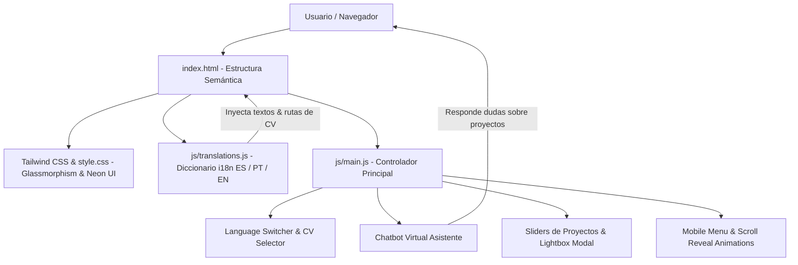

<div align="center">

  <!-- TYPEWRITER BANNER -->
  <a href="https://susejgo89.github.io/portafolio-personal/">
    
  </a>

  <p align="center">
    <strong>Portafolio Web Personal & Hub de Proyectos de Software</strong><br>
    Construido con una arquitectura moderna en <em>Vanilla JavaScript</em>, <em>Tailwind CSS</em> y diseño <em>Dark Glassmorphism</em>, integrando soporte multi-idioma (ES / PT / EN) y un asistente virtual interactivo.
  </p>

  <!-- LIVE STATUS BADGES -->
  <p align="center">
    <a href="https://susejgo89.github.io/portafolio-personal/" target="_blank">
      
    </a>
    <a href="https://linkedin.com/in/susejgo" target="_blank">
      
    </a>
    <a href="https://wa.me/5548991242305" target="_blank">
      
    </a>
  </p>

  <p align="center">
    
    
    
    
  </p>

</div>

---

## 🌟 Características Principales del Portafolio

* 🌐 **Soporte Multi-idioma Dinámico (i18n):** Cambio instantáneo en caliente entre **Español**, **Portugués** e **Inglés** sin recargar la página, sincronizando descargas de CVs específicas para cada idioma.
* 🤖 **Asistente Virtual / Chatbot Interactivo:** Chatbot integrado en Vanilla JS con procesamiento de intenciones (*keywords matching*) para responder preguntas sobre proyectos, cursos de IA en SENAI/SC y tecnologías.
* 🖼️ **Visores Interactivos & Sliders:** Carruseles táctiles y soporte para visualización de capturas en alta resolución con modal Lightbox.
* 🎨 **Estética Visual Dark Glassmorphism:** Paleta de colores curada neón/violeta/cian, bordes translúcidos con `backdrop-blur` y animaciones fluidas con micro-interacciones.
* 📱 **Arquitectura 100% Responsiva:** Adaptado fluidamente a dispositivos móviles, tablets y monitores ultra-wide.
* ⚡ **Rendimiento & Cero Dependencias Pesadas:** Carga ultra rápida sin frameworks invasivos, utilizando Tailwind CSS optimizado e iconos SVG oficiales.

---

## 🏛️ Diagrama de Arquitectura



---

## 🚀 Proyectos en Producción & Repositorios

<table>
  <thead>
    <tr>
      <th>Proyecto</th>
      <th>Tipo / Estado</th>
      <th>Stack Tecnológico</th>
      <th>Enlaces</th>
    </tr>
  </thead>
  <tbody>
    <tr>
      <td><strong>🏆 DominoPro</strong></td>
      <td></td>
      <td><code>React.js</code> <code>Tailwind CSS</code> <code>Firebase Firestore</code> <code>Auth</code></td>
      <td>
        <a href="https://dominopro1.com/" target="_blank">🌐 Demo</a> • 
        <a href="https://github.com/susejgo89/domino-pro-app" target="_blank">💻 Código</a>
      </td>
    </tr>
    <tr>
      <td><strong>📺 NexusRePlay</strong></td>
      <td></td>
      <td><code>JavaScript ES6+</code> <code>Tailwind</code> <code>Cloud Functions</code> <code>Gemini API</code></td>
      <td>
        <a href="https://sutechtvcorporativa.web.app/" target="_blank">🌐 Demo</a> • 
        <a href="https://github.com/susejgo89/sync-cast-app" target="_blank">💻 Código</a>
      </td>
    </tr>
    <tr>
      <td><strong>🤖 Agente IA de Prospección B2B</strong></td>
      <td></td>
      <td><code>Python 3</code> <code>Streamlit</code> <code>Google Gemini</code> <code>Places & Sheets API</code></td>
      <td>
        <a href="https://github.com/susejgo89/agente_prospeccion_maps_sheets" target="_blank">💻 Código en GitHub</a>
      </td>
    </tr>
    <tr>
      <td><strong>✨ Borderless Design & Party</strong></td>
      <td></td>
      <td><code>HTML5</code> <code>CSS3</code> <code>JavaScript</code> <code>SEO</code></td>
      <td>
        <a href="https://borderlessdesignandparty.com/" target="_blank">🌐 Demo</a>
      </td>
    </tr>
  </tbody>
</table>

---

## 🛠️ Stack Tecnológico

<div align="center">

  <!-- TECNOLOGÍAS FRONTEND -->
  
  
  
  
  

  <br />

  <!-- BACKEND & IA -->
  
  
  
  

</div>

---

## 📂 Estructura del Repositorio

```bash
portafolio/
├── css/
│   └── style.css            # Clases utilitarias, animaciones glow y glassmorphism
├── js/
│   ├── main.js             # Controlador de eventos, chatbot, lightbox y sliders
│   └── translations.js     # Diccionario de textos en Español, Portugués e Inglés
├── images/
│   ├── borderless/         # Capturas de Borderless Design & Party
│   ├── dominopro*.png      # Capturas de DominoPro en producción
│   ├── nexusplay*.png      # Capturas de NexusRePlay Digital Signage
│   ├── prospector.png      # Mockup visual del Agente IA de Prospección
│   ├── logo_icon.png       # Isotipo optimizado de alta resolución
│   └── *.pdf               # Currículums oficiales en ES, PT y EN
├── index.html              # Estructura semántica principal y marcado i18n
├── GITHUB_PROFILE_README.md# Plantilla animada para el perfil principal de GitHub
└── README.md               # Documentación completa del proyecto
```

---

## 💻 Ejecución Local

Para clonar y visualizar este portafolio en tu entorno local:

```bash
# 1. Clonar el repositorio
git clone https://github.com/susejgo89/portafolio-personal.git

# 2. Entrar a la carpeta
cd portafolio-personal

# 3. Abrir con cualquier servidor local (ej. Live Server en VS Code o Python)
python3 -m http.server 8000
```

Abre en tu navegador: `http://localhost:8000`

---

## 📬 Contacto

<div align="center">
  <p><strong>Susej Gonzalez</strong> — Desenvolvedora Front-End & Agentes de IA</p>
  <p>
    <a href="https://linkedin.com/in/susejgo" target="_blank">
      
    </a>
    <a href="https://wa.me/5548991242305" target="_blank">
      
    </a>
    <a href="mailto:susejgo@gmail.com">
      
    </a>
  </p>
</div>